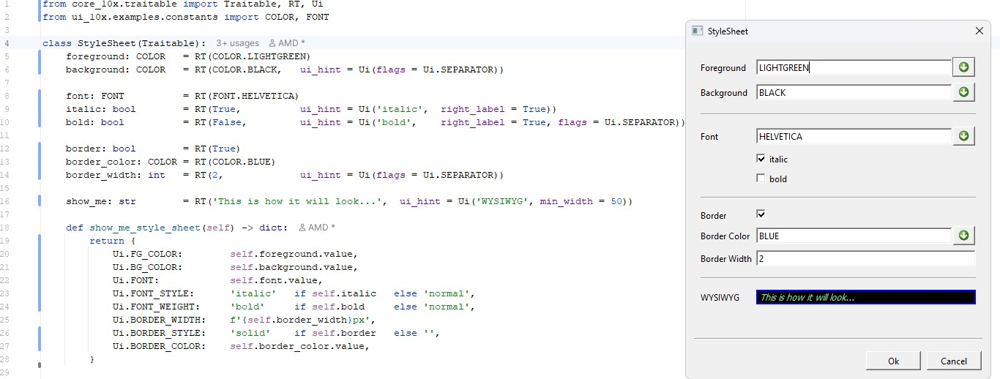

# py10x-core

**The Substratum of Genaxy** — a generative core for software, not a feature list.

[](https://www.python.org)
[](https://opensource.org/licenses/MIT)


## 🌌 Why Genaxy?

10x exists for one audience: engineers, researchers, and developers who want to be 10 times more productive — not through better tooling at the edges, but by never having to rebuild the same foundation twice.

**Genaxy** is what makes that possible: a new kind of software system, built around a small, generative core rather than assembled feature by feature. At its center sits the **Substratum** — `py10x-core` — a handful of laws, not a feature set: identity, dependency, persistence, presentation. Everything else follows from these.

Around the Substratum sit **Subject Domains** — real fields of work, each built on the same foundation instead of reinventing it. Finance is the first: `py10x-fin-base`. More will follow. Each domain surrounds the Substratum the way planets surround a star — independent, distinct, but all held together by the same underlying laws.

Most software is built domain-first: a finance system, a healthcare system, a logistics system — each one reinventing identity, persistence, and UI from scratch. Genaxy inverts that. Build the Substratum once. Let every domain grow from it.

The four laws aren't a checklist to memorize — they're vocabulary for *describing* a real-world problem, before any specific technology gets chosen. Say what a thing **is** (its identity), what it **depends on**, where it **needs to live**, and how someone should **see and touch it** — and the application, the report, the service you actually needed falls out of that description, largely for free. More laws may join this list over time; the point was never the current four. It's that describing a problem well is what makes building it easy.

---

## 🏁 Identity and Dependency, in Nine Lines

By default, the `Traitable` constructor accepts **only ID traits**. For how the framework uses identity and storage to resolve or create instances, see [How Traitables Are Created](https://github.com/10x-software/py10x/blob/main/GETTING_STARTED.md#how-traitables-are-created) in the Getting Started guide.

```python
from core_10x.traitable import Traitable, T, RT
from core_10x.exec_control import GRAPH_ON, CACHE_ONLY

class Developer(Traitable):
    handle: str      = T(T.ID)           # ← identity trait → global sharing
    coffee_cups: int = T(default=0)      # persistent
    energy: int      = RT()              # runtime-only (not stored)

    def energy_get(self) -> int:
        return self.coffee_cups * 20

# In-memory mode (no storage), dependency graph on.
with CACHE_ONLY(), GRAPH_ON():
    dev = Developer(handle="ghost")
    dev.coffee_cups = 5
    print(dev.energy)           # 100 ← computed lazily on first access

    dev.coffee_cups = 6
    print(dev.energy)           # 120  ← recomputed due to dependency change

    # Same identity → same object
    dev2 = Developer(handle="ghost")
    print(dev2.energy)          # 120  ← shared via global cache
```

Two of the four laws, in nine lines: `handle` is the *identity*, `energy` is a *dependency* on `coffee_cups`, tracked and recomputed automatically. For automatic persistence, per-class stores, querying, nested objects, and more, consult the comprehensive Getting Started documentation.

---

## 🗄️ Everything Is a Resource

Real systems rarely live in one database. Genaxy treats every external dependency — a MongoDB cluster, a Postgres box, a DuckDB file, a credentials vault — as a `Resource`: addressed by a plain URI, resolved to a concrete driver through a small, pluggable registry. The Traitable Store you persist objects to is just one kind of `Resource`, alongside anything else your system depends on.

You define **logical** resources — names your code refers to, like `"main"` or `"mkt_data"` — and assign each one to a **physical** location (an actual URI) separately, per environment. Traitable classes associate themselves with a logical resource by name, so different parts of a system can live on different physical stores without any downstream code needing to know or care which.

Authentication follows the same shape. A user registers once: an RSA keypair is generated on their own machine, the private key is encrypted with their own master password, and everything lands in the OS keyring — never transmitted, never stored in plaintext. From that point on, every resource that user is entitled to just works, with no per-database credential wiring anywhere in application code.

---

## 🎨 The UI Is Derived, Not Written

Presentation is the fourth law, and it works the same way: describe the shape of the thing, and the UI for viewing and editing it comes for free. A dropdown that only accepts valid values isn't a widget you configure — it falls out of typing the trait as a `NamedConstant`:

```python
from core_10x.traitable import Traitable, RT, Ui
from ui_10x.examples.constants import COLOR, FONT

class StyleSheet(Traitable):
    foreground: COLOR   = RT(COLOR.BLACK)
    background: COLOR   = RT(COLOR.WHITE,   ui_hint = Ui(flags = Ui.SEPARATOR))

    font: FONT          = RT(FONT.HELVETICA)
    italic: bool        = RT(False,         ui_hint = Ui('italic',  right_label = True))
    bold: bool          = RT(False,         ui_hint = Ui('bold',    right_label = True, flags = Ui.SEPARATOR))

    border: bool        = RT(False)
    border_color: COLOR = RT(COLOR.BLUE)
    border_width: int   = RT(2,             ui_hint = Ui(flags = Ui.SEPARATOR))

    show_me: str        = RT('This is how it will look...',  ui_hint = Ui('WYSIWYG', min_width = 50))

    def show_me_style_sheet(self) -> dict:
        return {
            Ui.FG_COLOR:        self.foreground.value,
            Ui.BG_COLOR:        self.background.value,
            Ui.FONT:            self.font.value,
            Ui.FONT_STYLE:      'italic'   if self.italic   else 'normal',
            Ui.FONT_WEIGHT:     'bold'     if self.bold     else 'normal',
            Ui.BORDER_WIDTH:    f'{self.border_width}px',
            Ui.BORDER_STYLE:    'solid'    if self.border   else '',
            Ui.BORDER_COLOR:    self.border_color.value,
        }
```

That's the entire program — no layout code, no widget wiring, no dropdown population logic. `TraitableEditor(StyleSheet()).popup()` generates the full dialog below: dropdowns, checkboxes, and a live preview that updates itself, because it's just another computed trait sharing the same dependency graph as everything else.



The same class definition renders as a native Qt desktop dialog or a Rio web view, depending only on which backend is active.

---

## 🧭 When Should You Build a Subject Domain on Genaxy?

Genaxy fits problems with:

- Real-world entities with derived, computed state
- A need for deterministic, shared identity across a whole system
- Data that outlives a single process — persistence you don't want to hand-roll
- A UI that should never drift out of sync with the model it displays

It's overkill for a simple script, a stateless API, or pure validation logic — those don't need a Substratum, they need a function. Genaxy pays off when a system's state and relationships keep evolving, and keeping everything in sync by hand is the actual cost center.

---

## 🔍 How Is This Different?

Compared to `dataclasses` or Pydantic — objects have deterministic identity from their ID traits; the same identity always resolves to the same logical entity; derived fields are lazily computed and dependency-tracked, not just validated once at construction.

Compared to traditional ORMs — identity isn't tied to a database row, and persistence is optional and pluggable per class, not baked into one schema.

Compared to reactive frameworks — dependencies are tracked automatically, computation is lazy by default, and the same graph drives persistence and UI, not just view updates.

---

## Documentation map

| I want to… | Read |
|------------|------|
| Read the full vision and history | [WHITEPAPER.md](WHITEPAPER.md) |
| Install py10x | [INSTALLATION.md](INSTALLATION.md) |
| Learn the Traitable framework | [GETTING_STARTED.md](GETTING_STARTED.md) |
| Install / use the finance Subject Domain (`xxfin`) | [xx_fin/README.md](xx_fin/README.md) |
| Contribute code | [CONTRIBUTING.md](CONTRIBUTING.md) |
| Cut a release / sync dev deps | [dev_10x/README.md](dev_10x/README.md) |

## 🤝 Contact & Support

- **Project e-mail:** [py10x@10x-software.org](mailto:py10x@10x-software.org)
- **Security:** Report vulnerabilities to [security@10x-software.org](mailto:security@10x-software.org)
- **Discord:** [Join the 10x Community](https://discord.gg/m7AQSXfFwf)
